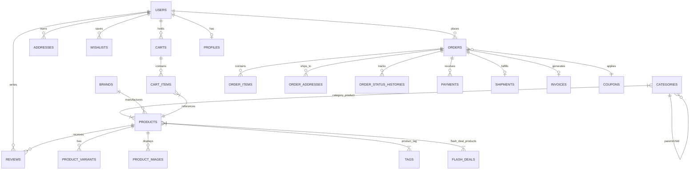

<p align="center">
  
</p>

<h1 align="center">OmniStore — Modern Enterprise E-Commerce & Retail POS Platform</h1>

<p align="center">
  A state-of-the-art, high-performance, full-stack E-Commerce platform built on <b>Laravel 12</b>, featuring <b>Retail Point of Sale (POS)</b>, an <b>AI Marketing & Support Automation Suite</b>, <b>Flash Sales with Real-Time Countdowns</b>, <b>Public Order Tracking</b>, <b>Multi-Gateway Global & Local Payments (Stripe, PayPal, bKash, Nagad, COD)</b>, and a <b>Headless RESTful API</b>.
</p>

<p align="center">
  <a href="https://php.net"></a>
  <a href="https://laravel.com"></a>
  <a href="https://tailwindcss.com"></a>
  <a href="https://stripe.com"></a>
  <a href="https://openai.com"></a>
  <a href="LICENSE"></a>
</p>

---

## 📑 Table of Contents

- [Architectural Overview](#-architectural-overview)
- [Comprehensive Feature Matrix](#-comprehensive-feature-matrix)
  - [1. Storefront & Customer Experience](#1-storefront--customer-experience)
  - [2. Flash Deals & Countdown Sales](#2-flash-deals--countdown-sales)
  - [3. Shopping Cart & Smart Coupon Engine](#3-shopping-cart--smart-coupon-engine)
  - [4. Seamless Checkout & Multi-Gateway Payments](#4-seamless-checkout--multi-gateway-payments)
  - [5. Public Order Tracking & Visual Progress Stepper](#5-public-order-tracking--visual-progress-stepper)
  - [6. Retail Point of Sale (POS) Cashier Terminal](#6-retail-point-of-sale-pos-cashier-terminal)
  - [7. AI Automation & Smart E-Commerce Suite](#7-ai-automation--smart-e-commerce-suite)
  - [8. Product Comparison Matrix & Wishlist](#8-product-comparison-matrix--wishlist)
  - [9. Headless & Mobile RESTful API (v1)](#9-headless--mobile-restful-api-v1)
  - [10. Administration, Security & Role-Based Access (RBAC)](#10-administration-security--role-based-access-rbac)
- [Database Architecture & Entity Relationships](#-database-architecture--entity-relationships)
- [System Requirements](#-system-requirements)
- [Installation & Quick Start Guide](#-installation--quick-start-guide)
- [Configuration & Environment Variables (.env)](#-configuration--environment-variables-env)
- [Payment Gateways Configuration](#-payment-gateways-configuration)
- [AI Automation Setup (OpenAI)](#-ai-automation-setup-openai)
- [REST API Reference (v1)](#-rest-api-reference-v1)
- [Artisan CLI Commands & Background Workers](#-artisan-cli-commands--background-workers)
- [Contributing & License](#-contributing--license)
- [Author & Contact Information](#-lets-build-something-exceptional)

---

## 🏛️ Architectural Overview

OmniStore is engineered to eliminate the boundaries between online digital commerce, physical brick-and-mortar retail stores, and AI-powered operational workflows. Built using Laravel 12 best practices, it provides:

1. **Dual-Channel Core**: Seamlessly synchronizes online e-commerce transactions and in-store Point of Sale (POS) physical cashier transactions against unified inventory pools.
2. **AI-First Capabilities**: Direct integration with Large Language Models (OpenAI GPT-4o / GPT-4o-mini) for autonomous product copywriting, automated SEO meta generation, and 24/7 customer support assistance.
3. **Global + Localized Payments**: Built-in support for international payment rails (Stripe Credit/Debit, PayPal) alongside Bangladesh's dominant Mobile Financial Services (bKash Tokenized Checkout and Nagad API).
4. **Hybrid Frontends**: Ships with dynamic, accessible Blade + Tailwind CSS storefront templates, accompanied by a full-fledged RESTful JSON API layer (`routes/api.php`) ready for headless React, Vue, Next.js, or Flutter/React Native mobile applications.

---

## 🚀 Comprehensive Feature Matrix

### 1. Storefront & Customer Experience
- **Responsive Modern UI**: Built with utility-first Tailwind CSS, responsive layouts, glassmorphism badges, and smooth micro-interactions.
- **Hierarchical Category Tree**: Unlimited nesting (Parent -> Child -> Sub-category) with automatic product rollups and sort ordering.
- **Brand Showcase**: Brand landing pages, logo sliders, and brand-based product filtering.
- **Multi-Faceted Search & Filtering**:
  - Live keyword search across title, SKU, and descriptions.
  - Category and Brand multi-selection.
  - Dynamic price range filters (min/max price).
  - Availability toggles (In-Stock only).
  - Sorting: Newest Arrivals, Price (Low to High / High to Low), Customer Rating, and Popularity/Sales.
- **Product Gallery & Variations**:
  - Multi-image zoom gallery with thumbnail picker.
  - Complex SKU variant management (Color, Size, Material, Custom Attributes) with independent stock and dynamic pricing.
  - Verified customer reviews with star ratings (1-5), customer photos, and verified purchase badges.
  - Automatic inventory status indicators (`In Stock`, `Low Stock`, `Out of Stock`, `On Backorder`).

### 2. Flash Deals & Countdown Sales
- **Timed Mega Sales**: Create time-bounded promotional events (e.g., *Black Friday*, *Summer Flash Sale*, *Eid Mega Deal*).
- **Live Countdown Timers**: Real-time JavaScript countdown displays showing days, hours, minutes, and seconds.
- **Configurable Discounts**: Percentage discounts or fixed cash reductions per campaign item with individual customer purchase limits.
- **Auto-Expiration**: Automatic status deprecation when the campaign deadline passes.

### 3. Shopping Cart & Smart Coupon Engine
- **Unified Cart Architecture**: Session-based cart for guest visitors automatically merges into the user's permanent database cart upon login or account registration.
- **Mini-Cart Drawer API**: Instant AJAX updates (`/cart/mini`) providing item counts, subtotal, and quick checkout previews without full page reloads.
- **Advanced Coupon Engine**:
  - Fixed dollar amount or percentage discounts.
  - Minimum order spend thresholds.
  - Maximum discount caps (e.g., 20% off up to $50).
  - Usage limits per coupon and per individual customer.
  - Time-bounded start and expiration dates.
  - Restriction by specific categories, products, or user IDs.

### 4. Seamless Checkout & Multi-Gateway Payments
- **Single-Page Streamlined Checkout**: Efficient, distraction-free checkout collecting shipping and billing details.
- **Address Book Integration**: Authenticated users can store and switch between multiple saved shipping and billing addresses with default presets.
- **Multi-Gateway Payment Processing**:
  - **Stripe**: Credit cards, debit cards, Apple Pay, Google Pay with secure element validation.
  - **PayPal**: PayPal smart checkout redirect and instant payment verification.
  - **bKash (MFS)**: Tokenized checkout with create payment, user authorization, and webhook execution callback.
  - **Nagad (MFS)**: Bangladeshi digital postal payment integration.
  - **Cash on Delivery (COD)**: Zero-friction offline payment method with automated confirmation.
- **Automated Tax & Shipping Calculation**: Flat-rate shipping, free shipping thresholds, and dynamic percentage tax rules.

### 5. Public Order Tracking & Visual Progress Stepper
- **Public Tracking Portal** (`/track-order`): Customers can track their shipments 24/7 without needing to log in, simply by entering their **Order Reference Number** and **Phone Number/Email**.
- **Interactive Visual Stepper**: Clear, graphical progression bar:
  $$\text{Order Placed} \longrightarrow \text{Confirmed} \longrightarrow \text{Processing} \longrightarrow \text{Dispatched / In Transit} \longrightarrow \text{Out for Delivery} \longrightarrow \text{Delivered}$$
- **Package Details Breakdown**: Itemized list of purchased items, prices, shipping courier details, and carrier tracking IDs.

### 6. Retail Point of Sale (POS) Cashier Terminal
- **Physical Retail Cashier Counter**: Built-in POS system designed for barcode scanners and touchscreen cashier terminals.
- **Instant Barcode / SKU Lookup**: Quick product search by SKU barcode, variant barcode, or product name (`/api/v1/pos/products`).
- **Rapid Cashier Checkout** (`/api/v1/pos/checkout`):
  - On-the-fly custom discounts and tax calculations.
  - Immediate inventory deduction from master stock.
  - Flexible tender types: Cash, Card, Mobile Financial Services (MFS), or Split Payments.
  - Change due calculation and instant POS thermal receipt generation.

### 7. AI Automation & Smart E-Commerce Suite
- **AI Product Copywriter**: Generates high-converting, persuasive short hooks and comprehensive HTML product descriptions with feature bullet points via OpenAI (`/api/v1/ai/generate-description`).
- **AI SEO Meta Generator**: Analyzes product titles and descriptions to craft optimized Meta Titles (max 60 chars), Meta Descriptions (max 155 chars), and target SEO search keywords (`/api/v1/ai/generate-seo`).
- **AI Customer Support Assistant**: Floating frontend chatbot widget (`/api/v1/ai/chat`) providing instant answers to shoppers regarding store shipping terms, return policies, order tracking, and product recommendations.
- **Social Media Marketing Automation**: Auto-generates compelling captions and promotional post drafts for Facebook and Instagram marketing channels.

### 8. Product Comparison Matrix & Wishlist
- **Side-by-Side Matrix (`/compare`)**: Compare up to 4 products simultaneously across pricing, brand, categories, availability status, ratings, and technical specifications.
- **AJAX Add & Remove**: Instant addition and removal with limit enforcement.
- **Customer Wishlist**: Save favorite products for later purchase with one-click migration into the active shopping cart.

### 9. Headless & Mobile RESTful API (v1)
- Clean, versioned RESTful endpoints powered by Laravel 12 and Laravel Sanctum token authentication:
  - Catalog browsing and detail lookups (`/api/v1/products`, `/api/v1/products/{slug}`).
  - Point of Sale cashier operations (`/api/v1/pos/products`, `/api/v1/pos/checkout`).
  - AI automation suite endpoints (`/api/v1/ai/chat`, `/api/v1/ai/generate-description`, `/api/v1/ai/generate-seo`).

### 10. Administration, Security & Role-Based Access (RBAC)
- **Granular Permissions**: Integrated with `spatie/laravel-permission` (Super Admin, Shop Manager, Inventory Staff, Support Agent).
- **Activity Audit Trail**: Dedicated `ActivityLog` tracking admin modifications, status changes, inventory updates, and order alterations.
- **Dynamic Store Settings Engine**: Cached, centralized key-value store (`Setting::get('key')`, `Setting::set('key', $val)`) controlling store info, currency codes, AI API keys, payment gateway credentials, and shipping fees.
- **Automated PDF Invoicing**: Clean, downloadable and emailable PDF invoices generated on order confirmation via `barryvdh/laravel-dompdf`.

---

## 🗄️ Database Architecture & Entity Relationships

The platform features **35+ production-grade database tables** with foreign key constraints, cascading deletes, database indexes, and full-text search capabilities:



### Models Summary

| Model | Primary Responsibilities |
| :--- | :--- |
| `User` | Customer and Admin accounts, role-based authorization (`HasRoles`), soft deletes. |
| `Product` | Product catalog, pricing, sale rules, inventory tracking, scopes (`active`, `featured`, `inStock`). |
| `ProductVariant` | Attribute combinations (Color/Size), variant-specific SKUs, stock, and price overrides. |
| `Category` | Parent-child nested taxonomy, banner images, SEO metadata, category-product pivot. |
| `Brand` | Manufacturer profiles, logos, website URLs, and associated products. |
| `FlashDeal` | Promotional campaign periods, countdown end times, banner assets. |
| `FlashDealProduct` | Campaign product allocations with fixed/percentage discount overrides. |
| `Cart` & `CartItem` | Guest session and authenticated customer shopping baskets, item calculations. |
| `Coupon` | Promo discount codes, validation logic (`isValidForAmount`), and discount computations. |
| `Order` | Order header, financial totals (subtotal, discount, tax, shipping), status workflow. |
| `OrderItem` | Immutable product purchase snapshots (historical product name, SKU, price, options). |
| `OrderAddress` | Historical delivery and billing address snapshots at time of order. |
| `OrderStatusHistory`| Audit timeline logging all order status transitions and timestamps. |
| `ProductCompare` | Side-by-side product comparison tracking per user or guest session. |
| `Review` | Customer star ratings, text reviews, customer photo uploads, approval moderation. |
| `Wishlist` | Saved favorite products per customer. |
| `Payment` | Transaction records, payment gateway identifiers (`stripe`, `paypal`, `bkash`, `nagad`, `cod`). |
| `Setting` | Cached application configuration engine (AI keys, gateway secrets, store info). |

---

## 💻 System Requirements

- **PHP**: 8.3 or higher (Extensions required: `bcmath`, `ctype`, `curl`, `dom`, `fileinfo`, `json`, `mbstring`, `openssl`, `pcre`, `pdo_mysql`, `tokenizer`, `xml`, `gd` or `imagick`)
- **Composer**: 2.6 or higher
- **Node.js**: 18.x or 20.x LTS & **NPM**
- **Database**: MySQL 8.0+, MariaDB 10.5+, or PostgreSQL 14+
- **Web Server**: Nginx, Apache, or Laravel Octane / Herd / PHP Built-in Server

---

## 🛠️ Installation & Quick Start Guide

Follow these steps to set up the project locally:

### 1. Clone & Install Dependencies
```bash
# Clone the repository
git clone https://github.com/your-username/ecommerce.git
cd ecommerce

# Install PHP dependencies
composer install

# Install Frontend NPM dependencies
npm install
```

### 2. Environment Configuration
```bash
# Create local environment file
cp .env.example .env

# Generate application encryption key
php artisan key:generate
```

### 3. Database Setup & Migrations
Update your `.env` file with your database connection credentials:
```env
DB_CONNECTION=mysql
DB_HOST=127.0.0.1
DB_PORT=3306
DB_DATABASE=ecommerce
DB_USERNAME=root
DB_PASSWORD=your_password
```

Run database migrations and seed default data:
```bash
# Run all migrations
php artisan migrate

# Seed roles, permissions, categories, brands, products, coupons, and settings
php artisan db:seed
```

### 4. Create Storage Symlink
```bash
php artisan storage:link
```

### 5. Build Assets & Launch Development Servers
Run the development environment using Laravel's concurrent runner:
```bash
# Builds frontend assets and runs Laravel server
npm run dev

# Or in a separate terminal:
php artisan serve
```

Visit the storefront in your browser at: **`http://127.0.0.1:8000`**

---

## ⚙️ Configuration & Environment Variables (.env)

Below is an overview of the key environment variables:

```env
APP_NAME="OmniStore"
APP_ENV=local
APP_KEY=base64:...
APP_DEBUG=true
APP_URL=http://127.0.0.1:8000

# Database
DB_CONNECTION=mysql
DB_HOST=127.0.0.1
DB_PORT=3306
DB_DATABASE=ecommerce
DB_USERNAME=root
DB_PASSWORD=

# Session, Cache & Queues
CACHE_STORE=database
QUEUE_CONNECTION=database
SESSION_DRIVER=file

# OpenAI AI Suite Configuration
OPENAI_API_KEY=your_openai_api_key_here
OPENAI_MODEL=gpt-4o-mini

# Stripe Payments
STRIPE_KEY=your_stripe_publishable_key
STRIPE_SECRET=your_stripe_secret_key
STRIPE_WEBHOOK_SECRET=your_stripe_webhook_secret

# PayPal Payments
PAYPAL_MODE=sandbox
PAYPAL_SANDBOX_CLIENT_ID=your_paypal_client_id
PAYPAL_SANDBOX_CLIENT_SECRET=your_paypal_secret

# bKash Payment Gateway (Bangladesh MFS)
BKASH_APP_KEY=your_bkash_app_key
BKASH_APP_SECRET=your_bkash_app_secret
BKASH_USERNAME=your_bkash_username
BKASH_PASSWORD=your_bkash_password
BKASH_SANDBOX=true

# Nagad Payment Gateway (Bangladesh MFS)
NAGAD_MERCHANT_ID=your_nagad_merchant_id
NAGAD_PUBLIC_KEY=your_nagad_public_key
NAGAD_PRIVATE_KEY=your_nagad_private_key
```

---

## 💳 Payment Gateways Configuration

### Stripe Setup
1. Obtain API credentials from the [Stripe Dashboard](https://dashboard.stripe.com/apikeys).
2. Populate `STRIPE_KEY` and `STRIPE_SECRET` in `.env` or navigate to **Admin Panel > Settings > Payments**.
3. Point your Stripe webhook listener to: `https://your-domain.com/payment/stripe/webhook`.

### bKash Tokenized Checkout (MFS)
1. Register on the [bKash Developer Portal](https://developer.bka.sh).
2. Enter your `BKASH_APP_KEY`, `BKASH_APP_SECRET`, `BKASH_USERNAME`, and `BKASH_PASSWORD`.
3. Set `BKASH_SANDBOX=false` when deploying to production.
4. The system automatically routes callbacks via the `payment.bkash.callback` route.

---

## 🤖 AI Automation Setup (OpenAI)

The platform includes autonomous AI agents for copywriting, SEO, and live shopper chat:

1. Obtain an API Key from [OpenAI Platform](https://platform.openai.com/api-keys).
2. Set `OPENAI_API_KEY` in `.env` or in the database via `Setting::set('openai_api_key', 'your_key_here')`.
3. **Product Copy Generator**:
   - Call `POST /api/v1/ai/generate-description` with `{"name": "Wireless Noise Cancelling Headphones", "features": ["40hr battery", "ANC"]}` to receive ready-to-publish short hooks and HTML descriptions.
4. **Autonomous Customer Chat**:
   - The interactive floating widget on the storefront automatically communicates with `POST /api/v1/ai/chat`, assisting customers with questions and suggestions in real time.

---

## 📡 REST API Reference (v1)

All endpoints accept and return `application/json`.

| Method | Endpoint | Description | Auth Required |
| :--- | :--- | :--- | :---: |
| `GET` | `/api/v1/products` | Browse active catalog with pagination & filters | No |
| `GET` | `/api/v1/products/{slug}` | Retrieve single product details with gallery & variants | No |
| `POST` | `/api/v1/ai/generate-description` | Generate AI-driven product descriptions | Admin (Sanctum) |
| `POST` | `/api/v1/ai/generate-seo` | Generate SEO meta title, description & keywords | Admin (Sanctum) |
| `POST` | `/api/v1/ai/chat` | Customer AI support assistant reply | No |
| `GET` | `/api/v1/pos/products` | Search products by barcode (SKU) or keyword for POS | Cashier / Admin |
| `POST` | `/api/v1/pos/checkout` | Execute instant POS cashier checkout and receipt print | Cashier / Admin |

---

## ⚡ Artisan CLI Commands & Background Workers

OmniStore provides dedicated artisan commands for scheduled jobs and maintenance:

```bash
# Expire abandoned and outdated shopping carts
php artisan carts:expire

# Audit inventory levels and dispatch low-stock alerts to administrators
php artisan stock:check-low

# Generate PDF invoices for processed orders
php artisan orders:generate-invoices

# Process queued jobs (emails, PDF generation, webhooks)
php artisan queue:work --tries=3
```

To enable automatic execution, add the Laravel scheduler to your server crontab:
```bash
* * * * * cd /path-to-your-project && php artisan schedule:run >> /dev/null 2>&1
```

---

## 🧪 Testing & Verification

Run automated test suites and code styling checks:

```bash
# Run PHPUnit test suite
php artisan test

# Verify all routes
php artisan route:list

# Code formatting & styling via Laravel Pint
./vendor/bin/pint
```

---

## 📄 License

The OmniStore platform is open-source software licensed under the [MIT License](LICENSE).

---

## 🤝 Let's Build Something Exceptional

I'm actively open to: **Remote Senior Full-Stack Roles · Freelance Contracts · Technical Partnerships · Long-Term Collaborations** in **Laravel · WordPress · React/Next.js · AI-powered Platforms · Security Audits · SaaS Architecture**.

- 📍 **Timezone**: UTC+6 (Dhaka/Rangpur) — flexible overlap for US, EU & Asia
- ⚡ **Available**: Immediately · Production-first · Fast delivery · Transparent communication

| Platform | Link |
| :--- | :--- |
| 🌐 Portfolio | [imrandev.bd](https://imrandev.bd/) |
| 💼 LinkedIn | [linkedin.com/in/imranbru99](https://www.linkedin.com/in/imranbru99/) |
| 🐙 GitHub | [github.com/imranbru99](https://github.com/imranbru99) |
| 🐦 X / Twitter | [@imrandev_bd](https://x.com/imrandev_bd) |
| 📺 YouTube | [@ImranDevBD](https://www.youtube.com/@ImranDevBD) |
| 📸 Instagram | [@imranbru99](https://www.instagram.com/imranbru99/) |
| 📘 Facebook | [ExpertImranDev](https://www.facebook.com/ExpertImranDev/) |
| 🎵 TikTok | [@imrandev_bd](https://www.tiktok.com/@imrandev_bd) |
| 🧵 Threads | [@imranbru99](https://www.threads.com/@imranbru99) |
| 📌 Pinterest | [@imrandev_bd](https://www.pinterest.com/imrandev_bd/) |
| 💬 WhatsApp | [+880 1576-918420](http://wa.me/+8801576918420) |
| 📧 Email | [me@imrandev.bd](mailto:me@imrandev.bd) |
| 🔗 All Links | [linktr.ee/ExpertImranDev](https://linktr.ee/ExpertImranDev) |

> *"Security isn't an add-on — it's the foundation. Scale, speed, and trust drive every line of code I write."*  
> — **Imran Ahmed**

